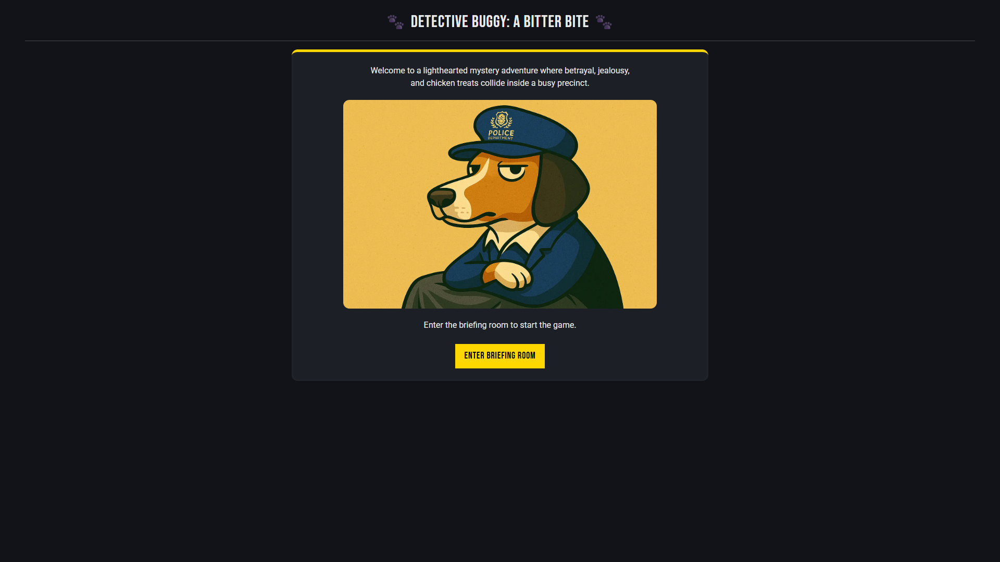
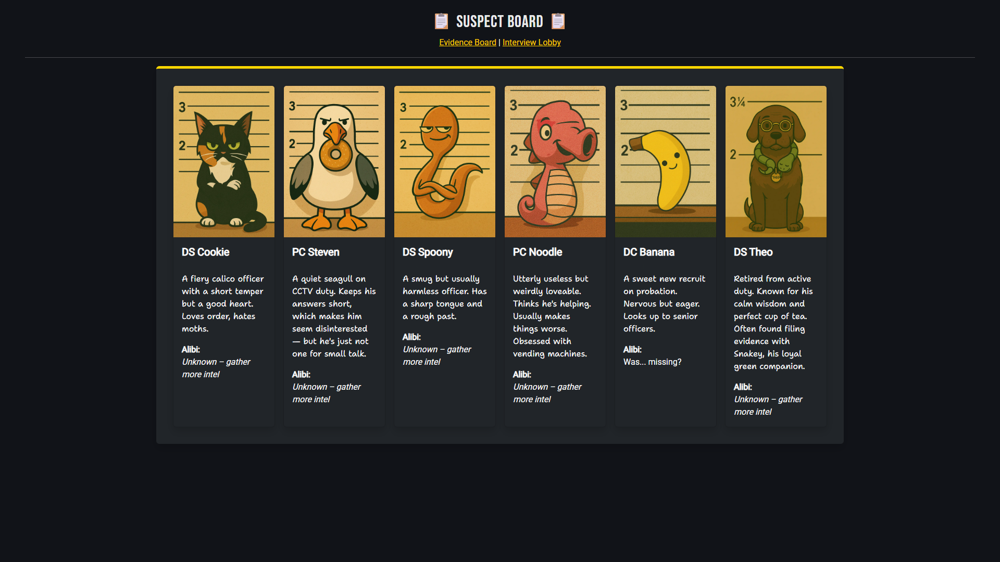
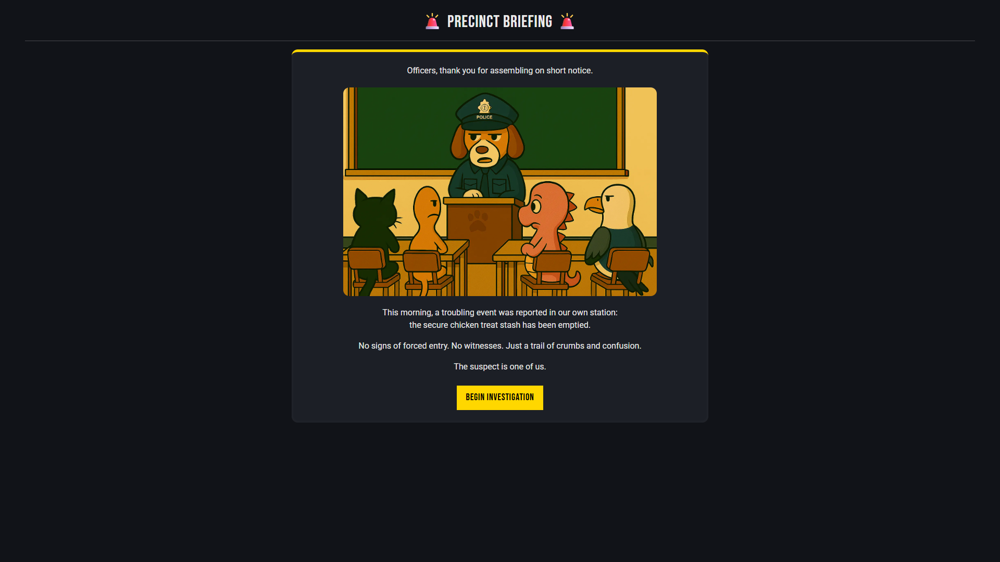

# 🕵️ Detective Buggy: Episode 1 – A Bitter Bite

Detective Inspector Buggy returns to the station... only to find his precious chicken treats have gone missing. Who’s behind the snack sabotage?

This is a lighthearted mystery game built as part of my CS50x final project.

It was also my first deployed Flask project, and it taught me a ton: managing scope, balancing logic with storytelling, handling real user input, creating routes and endpoints, and passing information between backend and frontend. I got much more comfortable with Git and GitHub, learned how to deploy with Render, and worked with databases — starting with SQLite and later migrating to PostgreSQL.

There’s definitely room for improvement (session handling, conditional logic in Jinja, and some DB queries could be cleaner), but I’m proud of how much I learned — and deeply grateful for the support I had to finish it. It was terrifying at first, but I did it. 🧠✨

Built using **Python**, **Flask**, **Jinja2**, **Bootstrap**, and **PostgreSQL** — with some (not very serious) paws-on QA 🐶

🔗 **Live version:** [https://detective-buggy-ep1.onrender.com](https://detective-buggy-ep1.onrender.com)

## 🚀 Features
- 🎤 Interactive suspect interviews
- 🧠 Clue-based deduction system
- 🗣️ Adaptive dialogue based on player progress
- 🗂️ Evidence board & branching logic

## 🖼️ Screenshots

<details>
<summary>Click to expand screenshots</summary>

### Title Screen


### Suspect Board


### Briefing Screen


</details>

## 🛠️ Run Locally

Clone the repo and install dependencies:

```bash
pip install -r requirements.txt
flask run
```

💡 If flask run doesn’t work, try setting ```FLASK_APP=app.py``` or running ```python app.py``` directly.

Ensure python-dotenv is installed and a .env file exists for your secret keys (if applicable).

### ⚠️ Recommended Python Version

**Python 3.10.x is recommended**  
Some dependencies may not work properly with newer versions (e.g. 3.12+), due to compatibility issues with libraries like Flask or SQLAlchemy.

We recommend using a **virtual environment (`venv`)** to avoid issues across setups.

<details>
<summary>Set up a virtual environment</summary>

```bash
# Make sure Python 3.10 is installed
python3.10 -m venv venv

# Activate it:
source venv/bin/activate       # macOS / Linux
venv\Scripts\activate          # Windows

# Install dependencies
pip install -r requirements.txt
```
</details>

## 🌐 Hosting
This project is deployed using Render.
Deployment instructions or render.yaml will be added in a future update.

## 🛠️ Potential Improvements
A list of potential improvements for future versions:

- ✅ Replace some hardcoded logic with dynamic, database-driven content
- ➡️ Replace repeated SQL cursor/connection logic with a fetch_all() helper for cleaner and safer DB access
- 🗃️ Migrate over Supabase (or Railway) for learning & since Render Postgres auto-expires
- 📱 Improve layout and styling for mobile and small screens (currently not supported)
- 🎨 Add simple animations for visual polish
- 🎵 Add audio support (ambience, barks, feedback sounds)
- 👣 Track player decisions for enhanced analytics *(note: analytics is currently private and optional)*
- 🪄 Fix line-breaks (yes, 8 years in localisation?.. good line-breaks is life!)
- 💾 [Stretch Goal] Implement user login/save progress system — not required for a small game, but a great learning opportunity!

## 👤 Credits

Created by [Jen Skye](https://github.com/skyejen)  
With paw-some assistance from Detective Inspector Buggy 🐶

Special thanks to:
- 🏹 **DCI Longbow** — for character backstories, constant encouragement, and lots of lemon & chili pasta
- 🎓 **CS50x**, my **brother**, and my **engineering crew** — for (re)lighting the spark and proving I could do this after all
